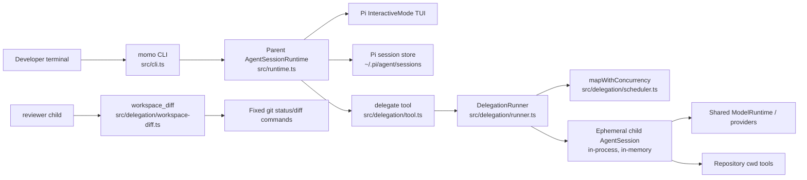
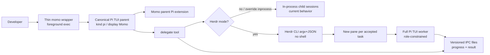

# Momo Architecture

Status: Package `momo-orchestrator@0.2.0` is an **implementation candidate** for baseline in-process orchestration plus the approved Herdr pane-worker target (mocked tests; live Herdr acceptance still operator-run and incomplete)
Document type: Durable architecture description (baseline current behavior, approved target, and candidate module map)
Last updated: 2026-07-26

Labels used below:

- **Verified:** confirmed by repository code inspection and/or automated package checks (`typecheck` / `test` / `build` / compiled CLI smoke).
- **Operator-run smoke:** executed and captured by Pi in the operator environment during the 2026-07-26 assessment; authoritative for what was observed then, but **not** reproduced by any repository-owned automated test or checked-in evidence artifact.
- **Approved target / implementation candidate:** user-approved Herdr pane-worker design (`SPEC.md` §32). Code for §32 is present in `0.2.0` with mocked coverage; **not live-compatible until §32.11 passes**.
- **Risk / limitation:** observed or structural constraint; not a design proposal.

## 1. Purpose, status, and scope

### Purpose

Momo is a local, interactive software-engineering orchestrator. It reuses the Pi coding-agent SDK and TUI, keeps one persistent parent conversation, and delegates bounded specialist work (scout, planner, implementer, reviewer) through a custom `delegate` tool.

### Status

| Item | State |
|---|---|
| Spec contract | `SPEC.md` version `1.1.0` (baseline + §32 Herdr target) |
| Package implementation | `package.json` version `0.2.0` |
| Pi SDK / CLI | `@earendil-works/pi-coding-agent` / `pi` `0.82.1` |
| Herdr | CLI `0.7.5`, protocol `17` (preflight-enforced) |
| Automated verification | `npm run typecheck` / `npm test` (mocked Herdr included) / `npm run build` / compiled CLI smoke |
| Authenticated manual acceptance | Incomplete (`SPEC.md` §27) |
| Live Herdr acceptance | Incomplete (`SPEC.md` §32.11); not claimed by this implementation pass |
| Historical operator smoke (2026-07-26) | Partial Pi misdetection / `agent_not_ready`; retained in §10 as pre-implementation evidence |

### Scope of this document

**Part A (§2–§12):** current runtime topology, module boundaries, execution flows, trust boundaries, concurrency, cancellation, observability, operator Herdr smoke evidence, and ADRs already embodied in code.

**Part B (§13–§14):** user-approved Herdr target architecture and target ADRs. Code for this target exists as an **implementation candidate** in `0.2.0` (mocked coverage); live Herdr acceptance remains incomplete.

Out of scope here: claiming live Herdr readiness, automatic product Git worktrees for specialist isolation, upstream Herdr `momo` kind, and other deferred items in `SPEC.md` §29 except as referenced by the approved target.

## 2. System context



**Verified:** Momo is a single Node.js process. Specialists are child **sessions**, not separate OS child processes.

**Risk:** The implementer's `bash` / `edit` / `write` tools run with the same OS permissions as the Momo process (`README.md`, `SPEC.md` §22).

## 3. Component catalogue

| Component | Path | Responsibility |
|---|---|---|
| CLI entry | `src/cli.ts` | Parse args; help/version/unknown-option exits; set `process.title = "momo"`; invoke runtime |
| Parent runtime | `src/runtime.ts` | Create Pi services/runtime; parent tool allowlist; `InteractiveMode`; dispose on exit |
| Prompts | `src/prompts.ts` | Parent and role system prompts; untrusted-repo policy text |
| Role registry | `src/roles.ts` | Immutable scout/planner/implementer/reviewer definitions and tool lists |
| Delegate tool | `src/delegation/tool.ts` | TypeBox schema; validation; progress `onUpdate`; result formatting |
| Delegation runner | `src/delegation/runner.ts` | Child factory wiring; single/parallel/chain execution; writer mutex; abort wait |
| Scheduler | `src/delegation/scheduler.ts` | Bounded parallel map; queue skip on abort |
| Results | `src/delegation/results.ts` | Text extraction, usage, 50 KiB truncation, status aggregation |
| Workspace diff | `src/delegation/workspace-diff.ts` | Fixed reviewer-only Git status/diff tool |
| Spec / docs | `SPEC.md`, `README.md`, `Architecture.md` | Contract, user setup, current architecture |
| Tests | `test/cli.test.ts`, `test/roles.test.ts`, `test/delegation.test.ts`, `test/scheduler.test.ts`, `test/results.test.ts`, `test/workspace-diff.test.ts` | Automated contract coverage |

## 4. Startup and execution flows

### 4.1 Startup

1. User runs `momo` or `momo <initial task...>` (`src/cli.ts`).
2. `runMomo` resolves cwd and calls `createMomoRuntime` (`src/runtime.ts`).
3. Runtime ensures `<agentDir>/sessions` exists, then builds a Pi `AgentSessionRuntime` factory that:
   - overrides the system prompt with `MOMO_SYSTEM_PROMPT`;
   - registers `delegate` plus parent tools `read`, `grep`, `find`, `ls`;
   - persists the parent via `SessionManager.create(cwd)`.
4. `InteractiveMode` runs until exit; `runtime.dispose()` runs in `finally`.

**Verified:** Parent construction uses Pi SDK layers `createAgentSessionServices` → `createAgentSessionFromServices` → `createAgentSessionRuntime` → `InteractiveMode`.

### 4.2 Single delegation

Parent model calls `delegate` with `mode: "single"`. Runner validates, queues one task, creates one child session, prompts once, waits for idle, extracts output/usage, disposes child, returns one `TaskResult`.

Any role, including implementer, may run in single mode.

### 4.3 Parallel delegation

`mode: "parallel"` accepts 1–8 read-only tasks. Validation rejects any `canWrite` role. `mapWithConcurrency` runs at most four children at once, preserves request order in results, and lets healthy siblings finish when another fails.

### 4.4 Chain delegation

`mode: "chain"` runs steps sequentially. Each step after the first substitutes every literal `{previous}` token with the preceding successful step's model-visible `output`. On failure/abort, remaining steps are `skipped` and no further sessions are created. Implementers are allowed because execution is serial.

### 4.5 Review path

After material edits, the parent is prompted to delegate a `reviewer`. The reviewer child receives `workspace_diff` (no model-supplied args) which runs only:

```text
git status --short
git diff --no-ext-diff --no-color
git diff --cached --no-ext-diff --no-color
```

## 5. Parent/child lifecycle and persistence

| Concern | Parent | Child |
|---|---|---|
| Session manager | `SessionManager.create(cwd)` | `SessionManager.inMemory(cwd)` |
| Lifetime | Persistent across launches | One task; never reused |
| Extensions / skills / prompts / themes | Normal Pi discovery under `~/.pi/agent` (and project context) | Explicitly empty loader (`src/delegation/runner.ts` `createChildResourceLoader`) |
| `AGENTS.md` | Discovered by parent services | Copied into child loader from parent discovery |
| Tools | `read`, `grep`, `find`, `ls`, `delegate` | Exact role allowlist only; never `delegate` |
| Process model | Same Node process | Same Node process (session isolation only) |

**Verified:** Children do not inherit parent extensions or skills.

**Risk:** Parent-enabled Pi extensions can still affect the parent session. Tool allowlisting in `src/runtime.ts` is the primary guard against parent mutation tools; extension behavior beyond that allowlist is not fully covered by Momo-owned tests.

## 6. Role and tool trust boundaries

| Role | Tools | Write? |
|---|---|---|
| scout | `read`, `grep`, `find`, `ls` | no |
| planner | `read`, `grep`, `find`, `ls` | no |
| implementer | `read`, `grep`, `find`, `ls`, `bash`, `edit`, `write` | yes |
| reviewer | `read`, `grep`, `find`, `ls`, `workspace_diff` | no |

Additional boundaries (**Verified** in code):

- Parent cannot `bash` / `edit` / `write`.
- Parallel mode rejects writers at validation time.
- Children cannot recurse via `delegate`.
- Delegation schema rejects cwd/model/tool/prompt overrides.
- Reviewer Git invocation uses `execFile` with an argument array (`shell: false`).
- Role prompts treat repository content as untrusted for policy override (`src/prompts.ts`).

## 7. Concurrency and writer-lock scope

| Mechanism | Scope | Behavior |
|---|---|---|
| Parallel scheduler | One `run()` of parallel mode | Max concurrency 4 (`MAX_PARALLEL_CONCURRENCY`) |
| Writer mutex (`writerTail`) | One `DelegationRunner` instance | Serializes all `canWrite` tasks across concurrent `run()` calls on that runner |
| Parallel validation | Request validation | Rejects implementer in parallel mode before startup |

**Verified:** `test/delegation.test.ts` covers serialization across concurrent delegations on the same runner.

**Risk / limitation:** The mutex is **process-local and per-runner**, not cluster-wide or cross-process. A second Momo process in the same repo is outside this lock.

## 8. Cancellation limitations

**Verified behavior** (`src/delegation/runner.ts`, `src/delegation/scheduler.ts`):

- Delegate `AbortSignal` stops queueing further parallel work.
- Active children receive `session.abort()`.
- Runner awaits the abort promise with `CHILD_ABORT_TIMEOUT_MS` (**5 seconds**) via `waitWithTimeout`.
- Active tasks become `aborted`; unstarted work becomes `skipped` (with a special case so all-skipped parallel aborts still surface an aggregate `aborted` status).
- Sessions dispose in `finally`.

**Limitations (current):**

- There is **no overall per-task or per-delegation wall-clock timeout** (only the abort-promise wait bound). Task timeouts remain a deferred enhancement in `SPEC.md` §29.
- If `abort()` does not finish within five seconds, the runner stops waiting; disposal still runs, but hung provider work is a residual risk.
- Cancellation depends on Pi session abort cooperativeness.

## 9. Observability

**Verified:**

- Progress phases: queued, started, text (throttled ~100ms), tool_started, tool_finished, completed/failed/aborted, aggregate parallel counts.
- Progress text for tools is the tool name only (arguments are not included in the progress message).
- Assistant text deltas are forwarded as progress messages without a dedicated secret-redaction filter.
- Final tool result text is `formatDelegationResult` summary; structured `DelegationResult` is stored in tool details; truncated bodies may include in-memory `fullOutput`.

**Risk / limitation:** Collapsed/expanded custom presentation described in `SPEC.md` §23 is **not implemented as a Momo-owned UI layer**. The product relies on **default Pi tool-result rendering**. Whether that rendering matches the §23 wishlist is **unverified**.

## 10. Current Herdr observations

**Provenance:** The pane-level facts in this section are **operator-run smoke evidence**. Pi directly executed and captured them in the operator environment during the 2026-07-26 assessment. They are authoritative for that run, but **no repository-owned automated Herdr test or evidence artifact exists yet**, so this document does not claim established Herdr compatibility.

**Conclusion from that smoke:** Momo was **partially detected and misidentified as Pi**. Herdr agent control (`herdr agent prompt`) **failed**. Compatibility is **not established**.

| Observation | Evidence label |
|---|---|
| Host had Pi Herdr integration installed (`~/.pi/agent/extensions/herdr-agent-state.ts`) | Operator-run environment fact (2026-07-26 assessment) |
| Momo launched in a disposable Herdr pane; historical pane id from that run was `w1:p5` (not a stable identifier) | Operator-run smoke (2026-07-26) |
| Session loaded `herdr-agent-state.ts` | Operator-run smoke (2026-07-26) |
| Herdr reported the agent as `agent: pi` with title `π - momo` | Operator-run smoke (2026-07-26) |
| `herdr agent prompt` failed with `agent_not_ready` because Momo was no longer considered the pane foreground process | Operator-run smoke / current-state limitation (2026-07-26) |
| Repository source contains no Herdr-specific integration code | Verified by repository inspection |
| Child sessions strip extensions, so in-process specialists do not report independent Herdr lifecycle | Verified in `src/delegation/runner.ts` |

Optional reproduction outline (pane ids will differ):

```bash
# From a built/linked momo, inside a Herdr workspace pane:
momo

# In another terminal attached to the same Herdr session:
herdr agent list
herdr pane read <pane-id> --source recent --lines 50
herdr agent prompt <name-or-pane> "ping" --wait --timeout 10000
```

Expect variability: detection may still show Pi rather than Momo, and `agent prompt` may fail with `agent_not_ready` if Momo is not the pane foreground process.

## 11. Known limitations

1. Authenticated `SPEC.md` §27 manual acceptance incomplete.
2. No OS sandbox; implementer equals host user permissions.
3. Writer serialization is per-runner / process-local only.
4. Specialists are in-process sessions, not isolated processes or Herdr panes.
5. No overall task timeout; only a 5s abort-wait bound.
6. Progress path does not implement active secret redaction of streamed text.
7. Observability presentation is default Pi rendering; custom §23 UX unverified.
8. Herdr compatibility is not established. Operator-run 2026-07-26 smoke showed misidentification as Pi (`agent: pi`, title `π - momo`) and `herdr agent prompt` failing with `agent_not_ready` when Momo was not the pane foreground process.
9. Package is private; contributors need local `npm install` / `build` / `link`.
10. Some normative SPEC presentation/redaction expectations remain unmet or unverified (see `SPEC.md` implementation-status notes).

## 12. Architecture decision records

### ADR-001 — Reuse Pi runtime and TUI

- **Status:** Accepted (implemented)
- **Context:** Building a custom TUI would duplicate Pi session, model, and editor behavior.
- **Decision:** Parent uses Pi SDK services, runtime, and `InteractiveMode` unchanged for interaction chrome.
- **Consequences:** Momo branding is prompt/tooling-level; UI layout remains Pi. Operator-run Herdr smoke (2026-07-26) observed classification as Pi; that does not establish Herdr compatibility.

### ADR-002 — Persistent parent + ephemeral children

- **Status:** Accepted (implemented)
- **Context:** Users need resumable orchestration history without persisting every specialist transcript.
- **Decision:** Parent uses `SessionManager.create(cwd)`; each child uses `SessionManager.inMemory(cwd)` and is disposed after one task.
- **Consequences:** Child histories do not appear in the persistent Pi session list; debugging specialists requires live progress/results only.

### ADR-003 — Fixed least-privilege roles

- **Status:** Accepted (implemented)
- **Context:** Unbounded tool access in every subagent would make single-writer and review independence unenforceable.
- **Decision:** Four immutable roles with exact tool allowlists; only implementer may mutate; parent is read-only plus `delegate`.
- **Consequences:** No user-defined roles in v1; capability changes require code/spec changes.

### ADR-004 — Single / parallel / chain delegate API

- **Status:** Accepted (implemented)
- **Context:** The parent model needs a small, schema-validated vocabulary for fan-out and sequencing.
- **Decision:** TypeBox discriminated union on `mode` with max eight tasks/steps and `{previous}` substitution in chains.
- **Consequences:** No arbitrary DAGs or workflow files; parallel writers are structurally impossible.

### ADR-005 — Per-runner writer mutex

- **Status:** Accepted (implemented)
- **Context:** Parallel request validation alone cannot serialize implementers started by overlapping parent tool calls.
- **Decision:** `writerTail` promise chain inside each `DelegationRunner` serializes `canWrite` tasks.
- **Consequences:** Safe within one runner/process; not a cross-process repo lock.

### ADR-006 — Constrained child resources

- **Status:** Accepted (implemented)
- **Context:** Parent extensions/skills could silently widen child capabilities or enable recursive delegation.
- **Decision:** Child `ResourceLoader` returns empty extensions, skills, prompts, and themes; role prompt + parent-discovered `AGENTS.md` only; no `delegate` tool.
- **Consequences:** Children do not load Herdr/Pi extensions; lifecycle reporting and skills remain parent-only.

### ADR-007 — Fixed reviewer Git tool

- **Status:** Accepted (implemented)
- **Context:** Reviewers need change context without arbitrary shell.
- **Decision:** Provide argument-less `workspace_diff` executing three fixed Git commands via `execFile`.
- **Consequences:** Non-Git cwd yields a non-fatal explanation; no custom diff args from the model.

### ADR-008 — 50 KiB model-visible output

- **Status:** Accepted (implemented)
- **Context:** Specialist output can exceed safe parent-context size.
- **Decision:** Truncate model-visible task text to 50 KiB UTF-8 with code-point-safe truncation; keep optional in-memory `fullOutput` in tool details when truncated.
- **Consequences:** Parent synthesis sees bounded text; full truncated bodies are not persisted to disk or child session storage.

---

## 13. Approved Herdr target architecture (0.2.0 implementation candidate; live acceptance pending)

**Authority:** User-approved implementation plan (Phase 2).
**Code status:** Implementation candidate in package `0.2.0` with unit/integration coverage against injected Herdr CLI/filesystem seams. Live Herdr matrix (`SPEC.md` §32.11) is still operator-run and incomplete — do not treat as shipped/live-compatible.
**Normative twin:** `SPEC.md` §32.

### 13.0 Shipped module map

| Module | Path |
|---|---|
| Thin wrapper / launch | `src/cli.ts`, `src/launch.ts` |
| Backend selection | `src/herdr/env.ts` |
| Herdr CLI adapter | `src/herdr/client.ts` |
| Pane registry | `src/herdr/registry.ts` |
| IPC spool | `src/ipc/spool.ts` |
| Writer lease | `src/lease/writer-lease.ts` |
| Remote ChildSession factory | `src/delegation/herdr-factory.ts` |
| Runner pre-allocation | `src/delegation/runner.ts` |
| Parent Pi extension | `src/extensions/parent.ts` → `dist/extensions/parent.js` |
| Worker Pi extension | `src/extensions/worker.ts` → `dist/extensions/worker.js` |
| In-process runtime (non-Herdr) | `src/runtime.ts` |

### 13.1 Goals of the target

1. Parent Momo is friendly and controllable in a Herdr terminal.
2. Every accepted specialist task (`scout`, `planner`, `implementer`, `reviewer`) runs as a **full Pi TUI** in a **newly created Herdr pane**, with detailed live activity visible there.
3. Parent↔worker coordination uses **private versioned IPC** as the authoritative progress/result channel (**never** TTY scraping).
4. Outside Herdr, preserve today’s in-process specialists (with explicit override).
5. When Herdr is detected but incompatible, **fail closed**.
6. Delivery uses a **separate development Git worktree + PR** as governance; Momo must **not** auto-create product Git worktrees for specialists.

### 13.2 Target system context



### 13.3 Parent process model

| Concern | Approved target |
|---|---|
| Entry | Thin `momo` wrapper that launches the **canonical Pi foreground parent** (so Herdr sees a real Pi foreground agent) |
| Herdr kind | Underlying kind remains **`pi`** |
| Display | Display name / metadata **Momo** via Momo parent Pi extension + `report-metadata` |
| Upstream `momo` kind | **Deferred**; not required for this target |
| Extension | Ship/load a **Momo parent Pi extension** for identity, lifecycle cooperation, and Herdr-facing display |
| Controllability | Keep parent as pane foreground; specialist panes created with **no focus steal** |

### 13.4 Specialist pane-per-worker backend

For each accepted specialist task under Herdr mode:

1. **Immediately allocate** a new Herdr pane when the task is accepted/queued (do not delay pane creation until the worker becomes active).
2. Launch a **full Pi TUI** worker in that pane, role-constrained to the assigned role.
3. Show detailed live activity in that pane’s terminal (human-visible Pi UI).
4. Enforce concurrency:
   - at most **four active read-only** workers (`scout` / `planner` / `reviewer`);
   - at most **one cross-process implementer** at a time (writer lease).
5. Queued tasks may already own panes while waiting for an active slot; inactive queued workers must not bypass concurrency or the writer lease.

### 13.5 IPC (authoritative)

- Private, **versioned** parent↔worker IPC directory/files for task input, heartbeats, progress events, and final result.
- IPC is the **only** authoritative channel for orchestration decisions and `TaskResult` ingestion.
- **Must not** scrape pane TTY/`herdr pane read` to decide completion or extract results.
- Pane TTY exists for human observation and debugging only.

### 13.6 Trust boundaries (unchanged policy, new surfaces)

- Exact role tool allowlists from `src/roles.ts`; workers **must not** receive `delegate`.
- Parent remains read-only plus `delegate` in the orchestration session.
- Herdr CLI invocations use **argv arrays without a shell**; stdout/stderr JSON **must be validated** before use.
- Cross-process **writer lease** replaces reliance on in-process `writerTail` alone when Herdr workers run.

### 13.7 Cancellation, heartbeat, crash, uncertain write

| Event | Approved rule |
|---|---|
| Cancel | Parent signals worker; stops scheduling; waits bounded time; marks aborted/skipped; retains panes until explicit cleanup |
| Heartbeat | Worker renews IPC heartbeat while alive; stale heartbeat ⇒ treat as crashed/unresponsive |
| Crash / missing result | Task fails or aborts; do not invent success from TTY |
| Implementer uncertain write | If writer lease was held and worker ends without a clean terminal result after possible mutation, surface **uncertain-write** risk to the parent/user; do not claim verified success |
| Lease release | Implementer lease releases only on clean completion, explicit abort handling, or supervised recovery rules defined in `SPEC.md` §32 |
| Cross-parent implementer wait | Second implementer **waits/retries** (cancellation-aware, default up to one hour) for the writer lease; never steals; stays read-only with waiting progress until acquire |

### 13.8 Pane retention

Completed, failed, and aborted specialist panes are **retained until explicit cleanup** (user or Momo cleanup command/flow). Automatic close-on-success is **not** part of the approved target.

### 13.9 Fallback and fail-closed

| Condition | Behavior |
|---|---|
| Not inside Herdr | In-process specialist backend (current behavior) |
| Explicit override to in-process | Allowed even inside Herdr (operator escape hatch) |
| Herdr detected but incompatible/unusable | **Fail closed** — delegation errors; do not silently degrade |
| Herdr mode active and healthy | Pane-per-worker backend required for accepted specialist tasks |

### 13.10 Platform and version alignment

- Initial support target: **macOS and Linux** only.
- Required versions for this candidate: **Pi** `0.82.1` (`@earendil-works/pi-coding-agent` / PATH `pi`) and **Herdr CLI** `0.7.5` (protocol `17`).
- In Herdr mode, `MOMO_PI_BINARY` is rejected unless it realpath-equals PATH `pi` (no resolve-and-discard).
- Windows and remote-only topologies remain out of scope.
- **Operator evidence (macOS, partial):** canonical parent prompt; scout E2E; four role panes opened; implementer exact ok-newline in a disposable fixture; reviewer `workspace_diff`; hardened active planner cancellation (aborted retained pane); retention/cleanup. **Still pending live:** queued-task cancellation, full cross-parent lease contention, crash recovery, Linux. Do **not** claim full `SPEC.md` §32.11.

### 13.11 Delivery governance (not product behavior)

Development of this target proceeds in a **separate Git worktree / feature branch** and lands through a **GitHub PR**. That process is **delivery governance only**. The product must **not** automatically create Git worktrees for specialist execution as part of Herdr mode.

### 13.12 Process-death and recovery honesty

| Event | Guaranteed behavior | Limitation |
|---|---|---|
| Parent `session_shutdown` | Writes cancel IPC for active registered workers; best-effort ctrl+c; does **not** close retained terminal panes | Hard kill / SIGKILL of the parent may skip this path |
| Parent relaunch (`session_start`) | Stable `parentId` (hash of Herdr pane + workspace + real cwd) rediscovers registry; privately validates `result.json` for active records (identity-checked); maps completed/aborted/failed/uncertain; idle/done/unknown without result → failed or uncertain; `working`/`blocked` without result stays active; corrupt result is terminal with notify (not startup crash) | Cannot resume in-flight tool calls; registry JSON corruption fails closed with an actionable error |
| Worker OS death without IPC result | Heartbeat stale / missing result ⇒ failed or uncertain-write (implementer) | No invent-success from TTY |

Shipped modules are listed in **§13.0** (not the obsolete “not yet created” table from earlier drafts).

---

## 14. Approved target ADRs (implemented candidate; live §32.11 incomplete)

### ADR-009 — Thin momo wrapper + Momo parent Pi extension

- **Status:** Accepted (**implemented** in `0.2.0`; live Herdr acceptance incomplete)
- **Context:** Launching a non-Pi-shaped process caused Herdr mislabeling and `agent_not_ready` during operator smoke.
- **Decision:** `momo` is a thin wrapper that execs a canonical Pi foreground parent; a Momo parent Pi extension sets display name **Momo** while Herdr kind remains **`pi`**. Upstream `momo` kind is deferred.
- **Consequences:** Controllability depends on Pi remaining pane foreground; branding is display/metadata-level until Herdr adds a native kind.

### ADR-010 — Pane-per-worker Herdr backend

- **Status:** Accepted (**implemented** in `0.2.0`; live Herdr acceptance incomplete)
- **Context:** In-process children hide specialist activity from Herdr and the user.
- **Decision:** Under Herdr mode, each accepted specialist task gets a newly created pane running a full Pi TUI worker; allocate panes when queued; cap four active read-only workers and one implementer.
- **Consequences:** Higher process/pane churn; layout management and cleanup UX become first-class; in-process path remains for non-Herdr.

### ADR-011 — Structured versioned IPC

- **Status:** Accepted (**implemented** in `0.2.0`; live Herdr acceptance incomplete)
- **Context:** TTY scraping is brittle and unsafe for orchestration truth.
- **Decision:** Private versioned IPC is authoritative for progress and results; never scrape TTY for completion or output extraction.
- **Consequences:** Workers must speak IPC correctly; human pane output can diverge visually without affecting orchestration correctness.

### ADR-012 — Cross-process writer lease

- **Status:** Accepted (**implemented** in `0.2.0`; live Herdr acceptance incomplete)
- **Context:** In-process `writerTail` cannot serialize implementers across OS processes/panes.
- **Decision:** Introduce a cross-process writer lease for implementers, composed with existing validation (no parallel implementers).
- **Consequences:** Requires crash/uncertain-write rules; lease path must be documented and tested.

### ADR-013 — Retain specialist panes until explicit cleanup

- **Status:** Accepted (**implemented** in `0.2.0`; live Herdr acceptance incomplete)
- **Context:** Users need to inspect completed/failed/aborted specialist TUIs after the parent synthesizes results.
- **Decision:** Retain those panes until explicit cleanup; do not auto-close on completion.
- **Consequences:** Pane accumulation risk; cleanup command/UX required; delivery docs must explain retention.

### ADR-014 — In-process fallback and Herdr fail-closed

- **Status:** Accepted (**implemented** in `0.2.0`; live Herdr acceptance incomplete)
- **Context:** Operators need a non-Herdr path and must not get silent degradation when Herdr is broken.
- **Decision:** Default in-process outside Herdr; allow explicit in-process override; if Herdr is detected but incompatible, fail closed.
- **Consequences:** Clearer errors inside broken Herdr sessions; override must be explicit and documented.
